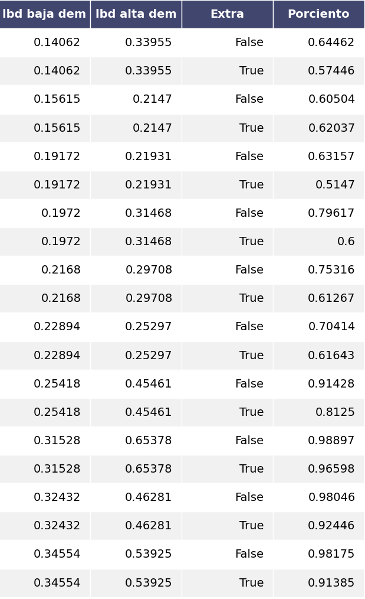

# Simulación - Eventos Discretos  

  
  

### Denis Gómez Cruz  
### C-412  

  
  
  
  
  
  
  

### Requerimientos y ejecución:  

Se debe contar con los paquetes `pandas`, `numpy` y `matplotlib` para la ejecución del proyecto, para esto solo es necesario correr con `python3` el fichero `kojo.py`. Los resultados obtenidos mediante la ejecución se encontraran en el fichero `fig.png`.  

### Problema  

Se quiere simular la llegada de clientes a la cocina de Kojo, donde hay dos horarios pico en el cual el número de clientes que llegan se eleva, el objetivo es comparar el porciento de clientes que tienen que esperar más de 5 minutos si se utiliza un empleado extra o no. Para más detalles sobre cómo funciona todo el proceso véase `orden.pdf`.  

### Implementación  

El método **exp_var** es una distribución exponencial con parámetro lambda, con la cual distribuyen los intervalos de tiempo entre las llegadas de los clientes.  

EL método **simulate** recibe tres parámetros:  

- `low_l` lambda con el que se distribuye cuando no se encuentra en horario pico.  

- `high_l` lambda con el que se distribuye cuando se encuentra en horario pico.  

- `extra` si se usa o no un empleado extra durante el horario pico.  

La estrategia usada para la simulación mantiene una lista `workers` con los clientes que está atendiendo cada trabajador, una cola `queue` para mantener los clientes que han llegado pero aún no han podido ser atendidos, el tiempo de arribo del siguiente cliente `arrival` y el tiempo que demora su pedido `a_time` el cual se calculó usando una distribución normal según el tipo de alimento que este quiere (también se usó una distribución uniforme para elegir el tipo de alimento).  

La parte fundamental de la simulación consta de 3 fases, las cuales se ejecutan mientras no acabe el horario de servicio:  

- Elegir el siguiente evento, el cual puede ser arribo o finalización de la elaboración del alimento de algún cliente (el que primero ocurra).  

- En cada caso agregar a la cola el nuevo cliente si es un evento de arribo o liberar el trabajador que termino la elaboración.  

- En caso de que algún trabajador quede disponible inmediatamente este atenderá a el primer cliente en la cola en caso de existir alguno.  

### Simulación  

  

En la tabla anterior las dos primeras columnas representan el parámetro lambda usado cuando no es horario pico y cuando lo es. La tercera columna indica si se usó un trabajador extra o no y por último la última columna contiene el porciento de clientes que esperaron más de 5 minutos por su pedido.  

Como podemos apreciar a medida que aumentamos el parámetro lambda las llegadas de los clientes van a ser más frecuentes por lo que el porciento de clientes que esperaron más de 5 minutos aumenta, usando en trabajador extra durante los horarios pico este porciento disminuye considerablemente, excepto en un caso donde el lambda es muy pequeño y por tanto la cantidad de clientes que llegan durante el horario de servicio es muy poca como para establecer una comparación dada la naturaleza de la distribución exponencial.  
